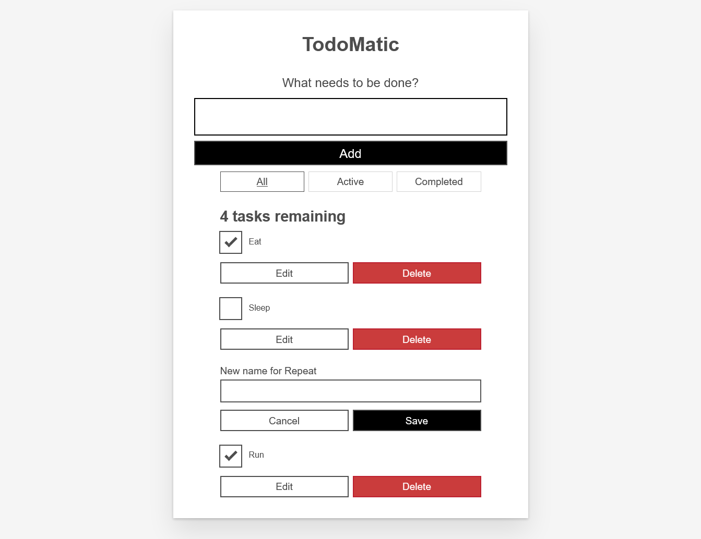

# MDN TodoMatic

This is the tutorial found in the documentation at [MDN Web Docs](https://developer.mozilla.org/en-US/docs/Learn/Tools_and_testing/Client-side_JavaScript_frameworks/React_getting_started). TodoMatic is a simple SPA, an implementation of which is intetded to show a little bit of detail about a particilar frontend framework. The project includes use cases of **useState**, **useRef** and **useEffect** hooks, shows how application can be divided into separate components, adopts [Nano ID](https://github.com/ai/nanoid) library to make unique element keys.

The project was deployed to GitHub with the help of [react-gh-pages](https://github.com/gitname/react-gh-pages) package. The master branch contains the app's source code (the code the app's developers edit), and the gh-pages branch contains a built version of the app (i.e. the code that GitHub Pages serves to the app's visitors).

- Live Site URL: [GitHub Pages](https://xs30snw.github.io/MDN-react-todomatic/)

## Screenshot

## Ideas for improvements
- [ ] move the *usePrevious()* function into its own file, export it from that file, and import it where you need it.